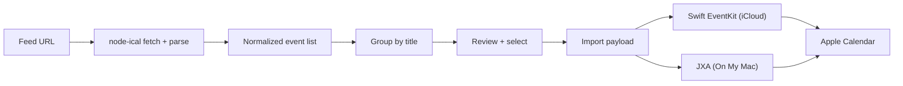

# CustomCal

<p align="center">
  <strong>A compact menubar utility for turning shared calendar feeds into your own Apple Calendar.</strong><br />
  Subscribe less. Curate more.
</p>

<p align="center">
  
  
  
  
  
</p>

## Calendar, Curated

> Calendar subscriptions are convenient.
>
> Living with every event forever is the hard part.

CustomCal is a lightweight desktop utility that lives in the menubar and turns a remote `ics` or `webcal` feed into a calendar you actually control. Paste a feed URL, preview the events, group repeating items by title, and import only the groups you want into a new calendar in Apple Calendar.

It is part feed importer, part review tool, and part escape hatch from all-or-nothing calendar subscriptions.

## Overview

At the center of the app is a simple idea: a shared calendar does not have to stay a subscription to stay useful.

CustomCal fetches a remote iCalendar feed, normalizes timed and all-day events, groups matching items by summary, and lets you review everything before anything is written to Calendar.app. When you are ready, it creates or reuses a destination calendar and imports the selected events into either `iCloud` or `On My Mac`.

The review flow lives in [`src/renderer/src/App.tsx`](src/renderer/src/App.tsx), while the import bridge and Apple Calendar logic live in [`src/main/importIcs.ts`](src/main/importIcs.ts).

## Highlights

- Menubar/tray app with a compact frameless popup instead of a full desktop window.
- Accepts both direct `https://...ics` feeds and `webcal://` URLs.
- Groups repeated events by normalized title so whole series can be included or skipped together.
- Supports importing into either `iCloud` or `On My Mac`.
- Creates the destination calendar if it does not already exist and applies a chosen color when possible.
- Uses `node-ical` for feed parsing and a native macOS import path for Apple Calendar integration.
- One-way import workflow that is intentionally simple and deliberate.

## How It Works

CustomCal moves feed data through five stages:

1. The user pastes an `ics` or `webcal` URL into the popup window.
2. The main process fetches and parses the feed with `node-ical`.
3. The renderer groups the parsed events by summary for review and selection.
4. The selected events are packaged for import into Apple Calendar.
5. The import is performed through EventKit for iCloud calendars or JXA for local calendars.

There are a few important details in that pipeline:

- `webcal://` feeds are normalized to `https://` before fetching.
- All-day events are treated carefully so Apple Calendar receives an exclusive end date.
- The app uses different native strategies for `iCloud` and `On My Mac` because those destinations behave differently on macOS.



## User Experience

### Import Flow

The main popup is designed to keep the import path short and clear. It collects:

- the source `ics` or `webcal` URL
- the new calendar name
- the destination account (`iCloud` or `On My Mac`)
- the calendar color

That screen is rendered by [`src/renderer/src/App.tsx`](src/renderer/src/App.tsx), with tray-window creation handled in [`src/main/index.ts`](src/main/index.ts).

### Review Events

After previewing the feed, CustomCal opens a review modal that groups events by summary title. If a feed repeats the same titled event many times, you can keep or remove the whole group with a single checkbox.

That makes the app especially useful for noisy calendars where recurring series matter more than one-off details.

## Tech Stack

- Electron for the menubar app, tray window, IPC, and desktop packaging
- React for the renderer UI
- TypeScript for the main, preload, and renderer layers
- Vite via `electron-vite` for development and production builds
- `node-ical` for remote iCalendar feed parsing
- Swift + EventKit for iCloud calendar imports on macOS
- JavaScript for Automation (`osascript`) for local `On My Mac` calendar imports

## Project Structure

```text
.
├── build/
│   ├── entitlements.mac.plist
│   ├── icon.icns
│   ├── icon.ico
│   └── icon.png
├── resources/
│   ├── icon.png
│   ├── tray-calendar-filter-template.png
│   └── tray-calendar-filter-template.svg
├── src/
│   ├── main/
│   │   ├── importIcs.ts
│   │   └── index.ts
│   ├── preload/
│   │   └── index.ts
│   └── renderer/
│       ├── index.html
│       └── src/
│           ├── App.tsx
│           ├── main.tsx
│           └── assets/
├── electron-builder.yml
├── package.json
└── tsconfig.json
```

## Getting Started

### Prerequisites

- Node.js 20+ is recommended
- npm
- macOS for the intended menubar and Apple Calendar workflow
- Apple Calendar access granted to the app when macOS prompts for it
- An iCloud account configured in Calendar if you want to import into `iCloud`

### Install

```bash
npm install
```

### Run In Development

```bash
npm run dev
```

This starts the Electron app in development mode with the Vite-powered renderer.

### Typecheck

```bash
npm run typecheck
```

### Build The App

```bash
npm run build
```

### Lint

```bash
npm run lint
```

## Packaging

CustomCal is currently configured primarily around a macOS-first experience, even though Electron Builder scripts are also present for Windows and Linux targets.

```bash
npm run build:mac
```

Other package scripts:

- `npm run build:unpack` builds an unpacked app directory
- `npm run build:win` builds the Windows target
- `npm run build:linux` builds the Linux target

The Electron Builder configuration lives in [`electron-builder.yml`](electron-builder.yml).

## Customization

If you want to change the behavior of the app, these are the main places to start:

- [`src/renderer/src/App.tsx`](src/renderer/src/App.tsx)
  Adjust the input flow, grouping UI, and review experience.
- [`src/main/importIcs.ts`](src/main/importIcs.ts)
  Change feed parsing, event normalization, all-day handling, and Apple Calendar import behavior.
- [`src/main/index.ts`](src/main/index.ts)
  Tune tray behavior, popup positioning, and Electron lifecycle details.
- [`src/renderer/src/assets/main.css`](src/renderer/src/assets/main.css)
  Restyle the popup and modal presentation.

## Notes And Limitations

CustomCal is intentionally not a full sync engine.

- It imports selected events once rather than maintaining a live subscription.
- It does not currently reconcile duplicates across multiple imports.
- It does not yet support editing or removing previously imported events as a managed set.
- It groups events by title, which is fast and practical, but may combine separate events that share the same summary.

That tradeoff keeps the app lightweight and makes the review flow understandable at a glance.

## License

CustomCal is released under the [MIT License](LICENSE.md).
